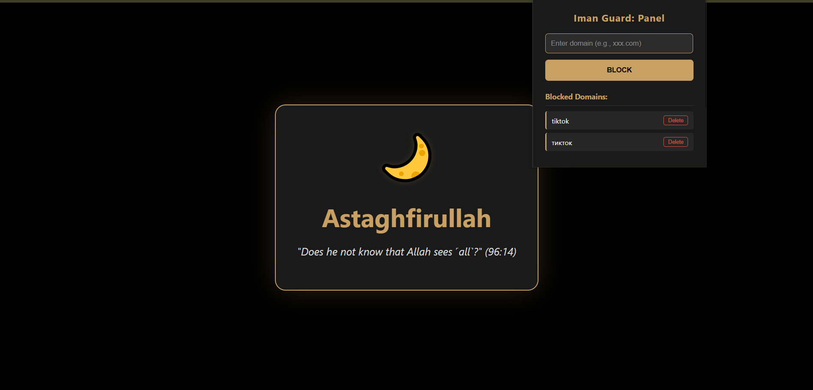

# 🌙 Iman Guard

**In the name of Allah, the Most Gracious, the Most Merciful. All praise is due to Allah, the Lord of the Worlds.**

The ultimate "Monk Mode" extension for spiritual and mental clarity. Iman Guard is not just a blocker; it's a discipline engine designed to remove triggers, reset your dopamine levels, and help you stay focused on what truly matters.

  

---

## ✨ Features
* **🌑 Forced Grayscale:** The entire web is in Black & White. Removes dopamine-loop visual triggers and makes addictive sites boring.
* **🕌 Adhan Reminders:** Plays a powerful, soul-stirring **Adhan by Nasir al-Katami** and shows Quranic ayats when a restricted site is blocked.
* **🕵️ Stealth History Purge:** Automatically wipes the last few seconds of your history after blocking a site. No traces left.
* **🛡️ Dynamic Blocking:** Add or remove domains instantly through the premium gold-themed popup panel.
* **🌍 Smart Encoding:** Full support for Cyrillic (non-Latin) domains and special characters.
* **🚀 High Performance:** Built using Chromium's `declarativeNetRequest` API — zero lag and zero battery drain.

---

## 🚫 Pre-Configured Protection
The extension comes with a built-in **Ban-List of 32 core keywords**. These keywords are automatically integrated into the rules to block the most common triggers and harmful content from the moment you install it. You can add more domains manually via the popup panel.

---

## 🧠 The Science & Wisdom
### 🔘 Why Grayscale?
Research into "Persuasive Design" shows that bright colors act as rewards for the brain. By removing color, you break the neurological feedback loop that keeps you scrolling. [Center for Humane Technology](https://www.humanetech.com/) experts recommend this as a primary tool against digital addiction.

### 🍵 Natural Support
We recommend drinking **Peppermint Tea**. Scientific studies suggest that peppermint can help lower free testosterone levels, providing a natural aid in your journey of self-control and lowering the gaze.

---

## ⚖️ Spiritual Foundation
### From the Holy Quran:
> "Tell the believing men to lower their gaze and guard their modesty. That is purer for them. Indeed, Allah is Acquainted with what they do." (Surah An-Nur, 24:30)

### From the Sahih Hadith:
The Prophet (ﷺ) said: "The adultery of the eyes is the looking (at that which is unlawful)." (Sahih Bukhari & Muslim)

---

## 🛠 Installation
1. Download this repository as a **ZIP** file and extract it to a folder.
2. Open your browser (Chrome, Edge, or Brave) and go to `chrome://extensions/`.
3. Enable **"Developer mode"** in the top right corner.
4. Click **"Load unpacked"** and select the folder where you extracted the files.
5. Pin **Iman Guard** to your toolbar for quick access.

---

## 🔊 Credits
* **Audio:** Adhan by Nasser Al-Qatami.
* **Philosophy:** Inspired by the concept of "Monk Mode" and Islamic self-discipline.

## 📜 License
MIT License. Free to use, modify, and distribute for the sake of the Ummah.

---

**May Allah accept this humble effort from us and make it a means of purification for the Ummah. If this tool helps you, please keep the developer in your Duas.**
